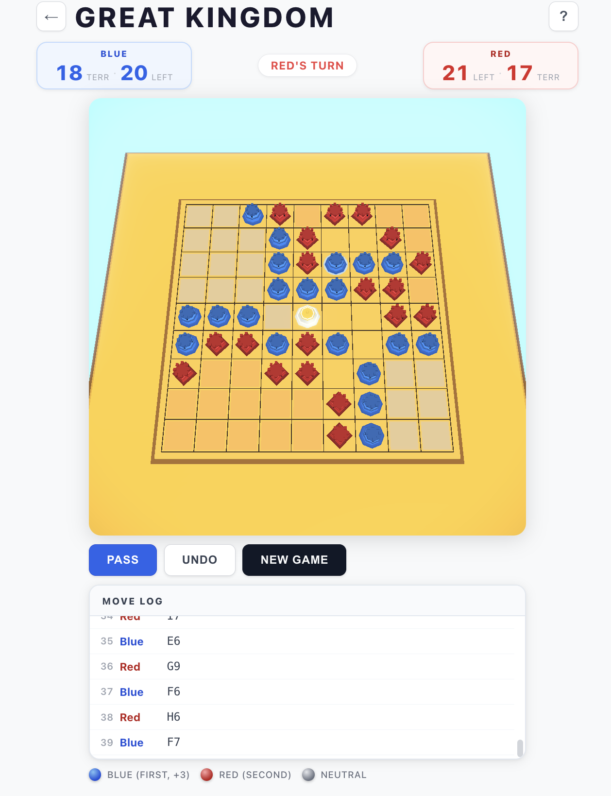

# Great Kingdom

A digital implementation of **Great Kingdom**, the 2-player strategy board game designed by legendary Go player **Lee Se-dol (9-dan)**, published by Korea Boardgames (Wizstone Series).



---

## Overview

Great Kingdom is played on a **9×9 grid** with one neutral castle fixed at the center. Two players — Blue and Red — take turns placing castle pieces, trying to encircle the opponent's pieces to win by capture, or control more territory when both players pass.

The game is available in two modes:

- **Local (Pass & Play)** — two players on the same device
- **Online Multiplayer** — real-time 1v1 via room codes, powered by Supabase

---

## Rules Summary

| | |
|---|---|
| **Board** | 9×9 grid, 1 neutral castle at center |
| **Pieces** | Blue: 40 castles · Red: 40 castles |
| **Win by Capture** | Fully encircle any enemy piece — game ends immediately |
| **Win by Territory** | Both players pass consecutively → count controlled territory; Blue (first player) needs **+3** to win (komi) |
| **Alive group** | A group is alive if it has at least one eye (even a false eye) |
| **No-entry rule** | Cannot place in territory fully controlled by the opponent |
| **No Ko rule** | Unlike Go, there is no Ko restriction |

---

## Tech Stack

| Layer | Technology |
|---|---|
| Frontend | React 19, React Router, Vite |
| 3D Rendering | Three.js, @react-three/fiber, @react-three/drei |
| Animation | @react-spring/three |
| Post-processing | @react-three/postprocessing (Bloom, Vignette) |
| Backend / Realtime | Supabase (Postgres, Realtime, Edge Functions) |
| Testing | Vitest |

---

## Features

- **3D board scene** — wooden board on a lacquered rectangular table, sky-blue atmosphere with daylight lighting
- **Detailed castle pieces** — Blue octagonal tower and Red square keep, each with two-tier architecture, arrow slits, and 8-merlon battlements; white neutral pagoda at center
- **Territory overlays** — live colour tinting shows controlled zones per player
- **Hover ghost** — semi-transparent piece preview on valid cells
- **Capture animation** — captured pieces fly off the board via spring physics
- **Suicide move detection** — invalid cells highlighted in red before placement
- **Move log** — scrollable history with coordinate notation (e.g. `Blue E6`)
- **Online multiplayer** — create/join rooms by code, optional password, public room browser, opponent presence indicator, reconnection handling
- **Server-side move validation** — Edge Function enforces rules independently of the client

---

## Getting Started

### Prerequisites

- Node.js ≥ 18
- A [Supabase](https://supabase.com) project (for online multiplayer)

### Install & Run

```bash
cd great-kingdom-app
npm install
npm run dev
```

### Environment Variables

Create `great-kingdom-app/.env.local`:

```
VITE_SUPABASE_URL=https://your-project.supabase.co
VITE_SUPABASE_ANON_KEY=your-anon-key
```

### Run Tests

```bash
cd great-kingdom-app
npm test
```

---

## Project Structure

```
great-kingdom-app/
├── src/
│   ├── components/
│   │   ├── 3d/               # Three.js scene (GameCanvas, Board3D, Piece3D, Cell3D)
│   │   ├── Lobby.jsx         # Main menu & room browser
│   │   ├── OnlineGame.jsx    # Online game screen
│   │   └── WaitingRoom.jsx   # Waiting for opponent
│   ├── hooks/
│   │   └── useRoom.js        # Multiplayer state & Supabase realtime
│   ├── gameLogic.js          # Core rules engine (pure functions)
│   ├── App.jsx               # Local game screen
│   └── moveLogDetect.js      # Move-log deduplication
├── supabase/
│   ├── schema.sql            # Database schema
│   └── functions/
│       └── validate-move/    # Server-side move validation Edge Function
└── great_kingdom_rules_EN.md # Full official rulebook
```

---

## Game Design Credit

Great Kingdom was designed by **Lee Se-dol**, one of the greatest Go players in history, and published by **Korea Boardgames** as part of the Wizstone Series.
